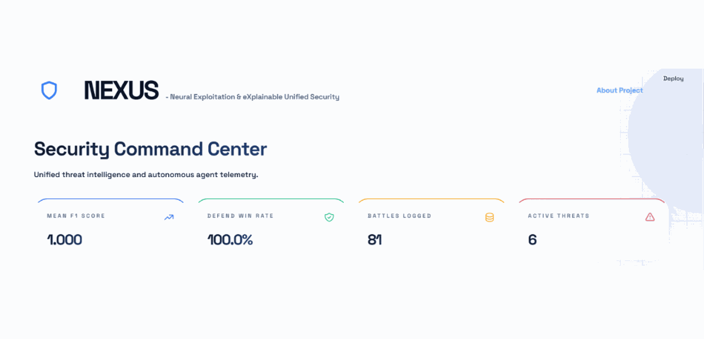
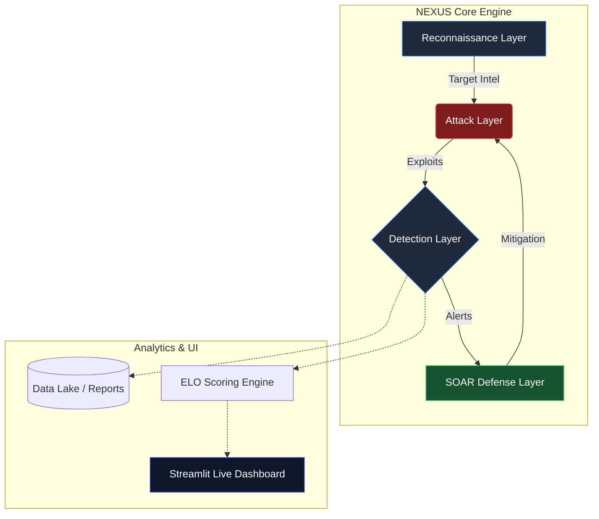

<div align="center">
  <picture>
    <source media="(prefers-color-scheme: dark)" srcset="assets/images/github_banner_dark.png">
    <source media="(prefers-color-scheme: light)" srcset="assets/images/github_banner_light.png">
    
  </picture>

  <p align="center">
    <strong>Advanced Autonomous Cyber Warfare & Threat Intelligence Simulation</strong>
  </p>
  
  <p align="center">
    <a href="https://github.com/vamsimuddada/NEXUS/stargazers"></a>
    <a href="https://github.com/vamsimuddada/NEXUS/network/members"></a>
    <a href="https://opensource.org/licenses/MIT"></a>
    <a href="https://www.python.org/downloads/"></a>
    <a href="https://streamlit.io"></a>
    <a href="https://nexus-vamsimuddada.streamlit.app/"></a>
  </p>
</div>

<br/>

> **NEXUS** is an enterprise-grade, AI-driven cyber warfare simulation environment. Designed for SOC teams, security researchers, and red/blue team operators, NEXUS provides a deeply interactive platform to simulate Advanced Persistent Threats (APTs), dynamically map behaviors to the **MITRE ATT&CK®** framework, and evaluate automated defensive mitigations.

<br/>

<div align="center">
  
</div>

<br/>

## ⚡ Executive Summary
Traditional breach and attack simulation tools rely on static, pre-defined playbooks. **NEXUS** introduces a paradigm shift by utilizing Large Language Models (LLMs) to power autonomous threat actors that continuously evolve their attack vectors. Coupled with a real-time Security Orchestration, Automation, and Response (SOAR) defense engine, NEXUS creates a dynamic, high-fidelity wargaming environment.

<br/>

## 🏗️ System Architecture

The platform operates on a modular, multi-layered architecture, separating the intelligence engines from the presentation layer.



<br/>

## 🚀 Core Capabilities

| Feature | Description | Engine |
| :--- | :--- | :--- |
| **🧠 Autonomous APTs** | Threat actors powered by LLMs (Ollama/Claude) that dynamically adapt. | `debate_engine.py` |
| **🛡️ Tri-Brain Defense** | Ensembled detection using Rules, Graph Neural Networks (GNN), and LLMs. | `tri_brain.py` |
| **📊 Real-Time Telemetry** | Live, interactive graphs mapping lateral movement across the network. | `graph_detector.py` |
| **📑 Executive Reporting** | One-click generation of professional PDF Threat Intel Reports. | `paper_gen.py` |
| **🎯 MITRE ATT&CK®** | Native mapping of all actor maneuvers to MITRE T-Codes. | `stix_exporter.py` |

<br/>

<details>
<summary><b>📂 Explore Project Structure</b> (Click to expand)</summary>

```text
NEXUS/
├── core/                  # Core simulation orchestrator
│   └── simulation.py      # Main state machine
├── defender/              # Blue Team AI
│   ├── gnn/               # Graph Neural Network detectors
│   ├── llm/               # LLM Debate engines
│   └── tri_brain.py       # Defense ensemble logic
├── scripts/               # Entrypoints
│   ├── dashboard.py       # Streamlit UI
│   └── run_simulation.py  # Headless CLI
└── requirements.txt       # Optimized dependencies
```
</details>

<br/>

## 💻 Quick Start

You can run NEXUS entirely locally. The system is designed to gracefully fallback to mocked telemetry if heavy local AI models (like Ollama) are unavailable.

```bash
# 1. Clone the repository
git clone https://github.com/vamsimuddada/NEXUS.git
cd NEXUS

# 2. Install requirements
pip install -r requirements.txt

# 3. Launch the Command Center
streamlit run scripts/dashboard.py
```

<br/>

## 🤝 Contributing & License
NEXUS is open-source and built for the security community. Please read [`CONTRIBUTING.md`](CONTRIBUTING.md) for details on our code of conduct and the process for submitting pull requests.

This project is licensed under the **MIT License** - see the [`LICENSE`](LICENSE) file for details.
