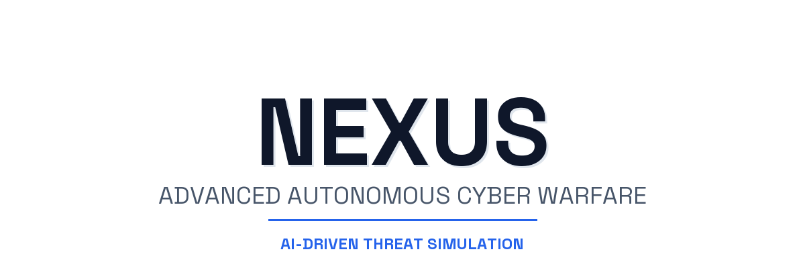
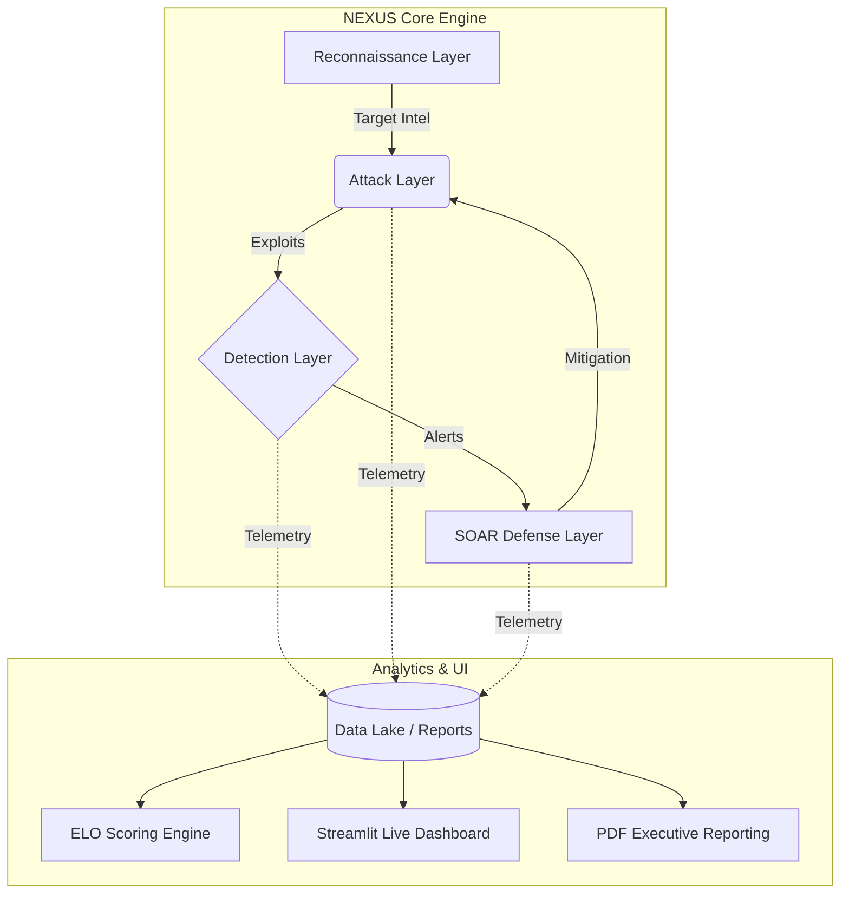

<div align="center">
  <picture>
    <source media="(prefers-color-scheme: dark)" srcset="assets/images/github_banner_dark.png">
    <source media="(prefers-color-scheme: light)" srcset="assets/images/github_banner_light.png">
    
  </picture>

  <p align="center">
    <strong>Advanced Autonomous Cyber Warfare & Threat Intelligence Simulation</strong>
  </p>
  
  <p align="center">
    <a href="https://github.com/vamsimuddada/NEXUS/stargazers"></a>
    <a href="https://github.com/vamsimuddada/NEXUS/network/members"></a>
    <a href="https://github.com/vamsimuddada/NEXUS/issues"></a>
    <a href="https://opensource.org/licenses/MIT"></a>
    <a href="https://www.python.org/downloads/"></a>
    <a href="https://streamlit.io"></a>
  </p>
</div>

<br/>

> **NEXUS** is an enterprise-grade, AI-driven cyber warfare simulation environment. Designed for SOC teams, security researchers, and red/blue team operators, NEXUS provides a deeply interactive platform to simulate Advanced Persistent Threats (APTs), dynamically map behaviors to the **MITRE ATT&CK®** framework, and evaluate automated defensive mitigations.

<br/>

## 🎯 Executive Summary
Traditional breach and attack simulation tools rely on static, pre-defined playbooks. **NEXUS** introduces a paradigm shift by utilizing Large Language Models (LLMs) to power autonomous threat actors that continuously evolve their attack vectors. Coupled with a real-time Security Orchestration, Automation, and Response (SOAR) defense engine, NEXUS creates a dynamic, high-fidelity wargaming environment.

<br/>

## 🏗️ System Architecture

The platform operates on a modular, multi-layered architecture, separating the intelligence engines from the presentation layer.



<br/>

## ✨ Enterprise Features

| Feature | Description | Target Use Case |
|---------|-------------|-----------------|
| **Autonomous Red Teaming** | LLM-driven agents dynamically construct attack kill-chains based on live defensive feedback. | Penetration Testing & Validation |
| **Active SOAR Defenses** | Automated incident response engine that isolates nodes, blocks IPs, and deploys honeypots. | Blue Team Training |
| **MITRE ATT&CK® Mapping** | Automatic translation of complex simulation events into standardized TTPs (Tactics, Techniques, and Procedures). | Threat Intelligence |
| **Dynamic ELO Scoring** | Chess-style rating system calculating the efficiency and win-rates of Attacker vs Defender models. | Performance Analytics |
| **Executive Reporting** | One-click generation of beautifully formatted, font-embedded PDF intelligence briefings. | C-Suite & Stakeholder Review |

<br/>

## 📁 Repository Structure

```text
NEXUS/
├── .github/                # GitHub Issue Templates & Workflows
├── assets/                 # Custom Fonts, UI elements, and Banners
├── data/                   # Simulation Databases and STIX bundles
├── integrations/           # Third-party SIEM & SOAR webhooks
├── scripts/                # Dashboard, PDF Generation, and Simulation Runners
├── tests/                  # PyTest validation suites
├── requirements.txt        # Strict environment dependencies
└── README.md               # Project documentation
```

<br/>

## 💻 Code Example

Integrate NEXUS into your own Python pipelines seamlessly:

```python
from scripts.run_simulation import NexusSimulation

# Initialize the warfare engine
engine = NexusSimulation(mode="autonomous", max_steps=50)

# Execute an LLM-driven APT attack
report = engine.execute_killchain(
    target_layer="layer2_attack",
    stealth_mode=True
)

# Output results mapped to MITRE ATT&CK
print(f"Simulation Complete. Exploited vulnerabilities: {report.exploits_used}")
print(f"Mitigated by SOAR: {report.soar_interventions}")
```

<br/>

## 🚀 Deployment Guide

<details>
<summary><b>1. System Requirements</b></summary>
<br/>

- Windows / macOS / Linux
- Python 3.10 or higher
- At least 8GB RAM (16GB recommended for local LLM inference)

</details>

<details>
<summary><b>2. Installation</b></summary>
<br/>

Clone the repository and install the strict dependencies:
```bash
git clone https://github.com/vamsimuddada/NEXUS.git
cd NEXUS
pip install -r requirements.txt
```

</details>

<details>
<summary><b>3. Launching the Command Center</b></summary>
<br/>

Start the interactive web dashboard. The application will automatically bind to `localhost:8501`.
```bash
streamlit run scripts/dashboard.py
```

</details>

<br/>

## 📈 Dashboard Interface
*(The live command center features dark-mode aesthetics, real-time telemetry, network heatmaps, and a buttery-smooth ambient tracking cursor).*

<p align="center">
  
  <br/>
  <i>Replace this placeholder with a high-resolution screenshot of the Streamlit dashboard</i>
</p>

<br/>

## 🛡️ License & Legal
This project is licensed under the **MIT License**. See the [LICENSE](LICENSE) file for complete details.

> **Disclaimer:** NEXUS is designed strictly for educational purposes, defensive research, and authorized simulations. Ensure you have explicit authorization before simulating attacks on any network.

---
<div align="center">
  <i>Developed for Advanced Agentic Cyber Defense.</i>
</div>
